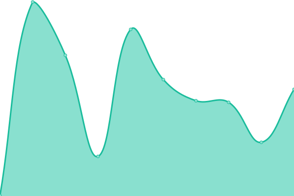

# [📈 Live Status](https://status.helloyeew.dev): <!--live status--> **🟩 All systems operational**

This repository contains the open-source uptime monitor and status page for [Phawit Pornwattanakul](helloyeew.dev), powered by [Upptime](https://github.com/upptime/upptime).

With [Upptime](https://upptime.js.org), you can get your own unlimited and free uptime monitor and status page, powered entirely by a GitHub repository. We use [Issues](https://github.com/helloyeew/site-uptime-monitor/issues) as incident reports, [Actions](https://github.com/helloyeew/site-uptime-monitor/actions) as uptime monitors, and [Pages](https://status.helloyeew.dev) for the status page.

<!--start: status pages-->
<!-- This summary is generated by Upptime (https://github.com/upptime/upptime) -->
<!-- Do not edit this manually, your changes will be overwritten -->
<!-- prettier-ignore -->
| URL | Status | History | Response Time | Uptime |
| --- | ------ | ------- | ------------- | ------ |
|  [rūrusetto](https://rulesets.info/) | 🟩 Up | [rurusetto.yml](https://github.com/HelloYeew/site-uptime-monitor/commits/HEAD/history/rurusetto.yml) | 

 459ms
     
 | 

<a href="https://helloyeew.github.io/site-uptime-monitor/history/rurusetto">100.00%</a>
    

|  [rūrusetto docs](https://docs.rulesets.info/) | 🟩 Up | [rurusetto-docs.yml](https://github.com/HelloYeew/site-uptime-monitor/commits/HEAD/history/rurusetto-docs.yml) | 

 264ms
     
 | 

<a href="https://helloyeew.github.io/site-uptime-monitor/history/rurusetto-docs">100.00%</a>
    

|  [beattosetto](https://beatsets.info/) | 🟩 Up | [beattosetto.yml](https://github.com/HelloYeew/site-uptime-monitor/commits/HEAD/history/beattosetto.yml) | 

 932ms
     
 | 

<a href="https://helloyeew.github.io/site-uptime-monitor/history/beattosetto">99.80%</a>
    

|  [homepage](https://helloyeew.dev/) | 🟩 Up | [homepage.yml](https://github.com/HelloYeew/site-uptime-monitor/commits/HEAD/history/homepage.yml) | 

 286ms
     
 | 

<a href="https://helloyeew.github.io/site-uptime-monitor/history/homepage">100.00%</a>
    

|  [story](https://story.helloyeew.dev/) | 🟩 Up | [story.yml](https://github.com/HelloYeew/site-uptime-monitor/commits/HEAD/history/story.yml) | 

 5038ms
     
 | 

<a href="https://helloyeew.github.io/site-uptime-monitor/history/story">95.76%</a>
    

|  [freedom dive web](https://game.rulesets.info/) | 🟩 Up | [freedom-dive-web.yml](https://github.com/HelloYeew/site-uptime-monitor/commits/HEAD/history/freedom-dive-web.yml) | 

 312ms
     
 | 

<a href="https://helloyeew.github.io/site-uptime-monitor/history/freedom-dive-web">99.90%</a>
    

|  [freedom dive server](https://server.rulesets.info/) | 🟩 Up | [freedom-dive-server.yml](https://github.com/HelloYeew/site-uptime-monitor/commits/HEAD/history/freedom-dive-server.yml) | 

 1879ms
     
 | 

<a href="https://helloyeew.github.io/site-uptime-monitor/history/freedom-dive-server">99.33%</a>
    

<!--end: status pages-->

[**Visit our status website →**](https://status.helloyeew.dev)

## 📄 License

- Powered by: [Upptime](https://github.com/upptime/upptime)
- Code: [MIT](./LICENSE) © [Phawit Pornwattanakul](helloyeew.dev)
- Data in the `./history` directory: [Open Database License](https://opendatacommons.org/licenses/odbl/1-0/)
